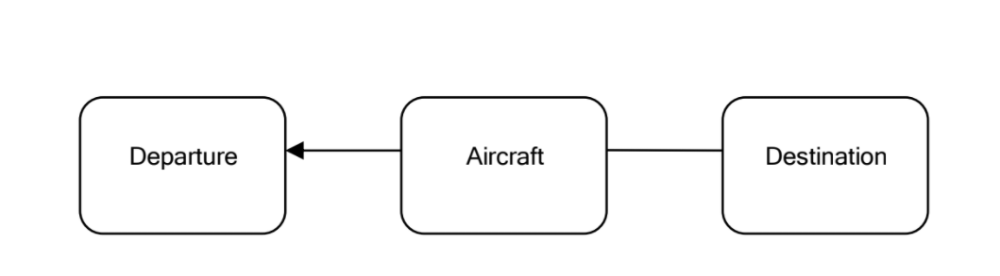
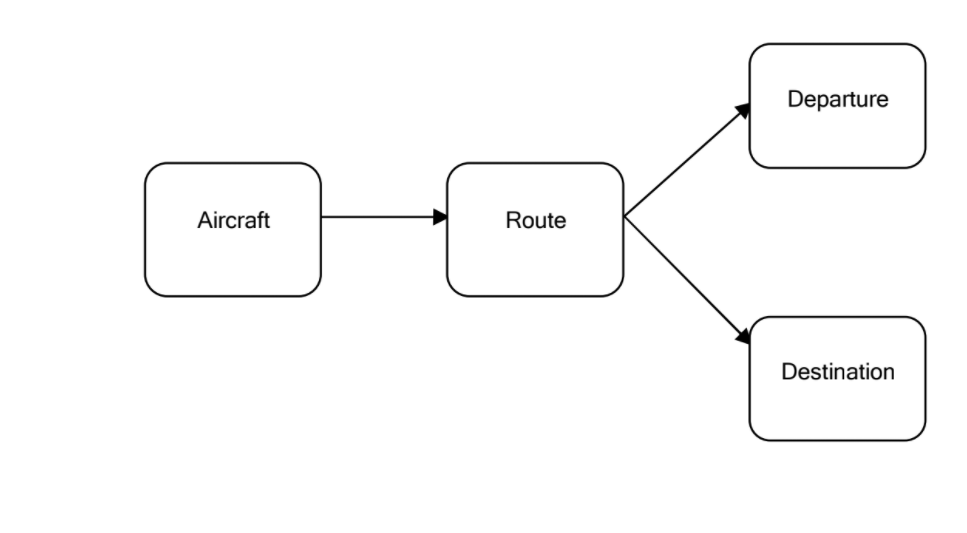
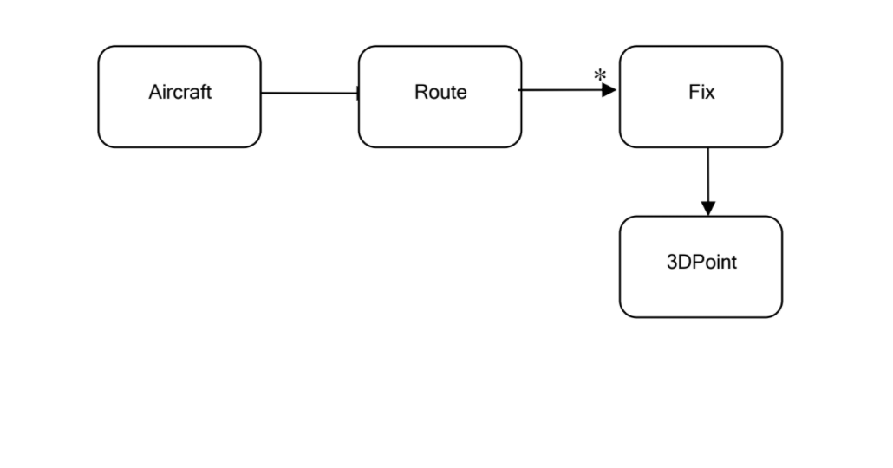
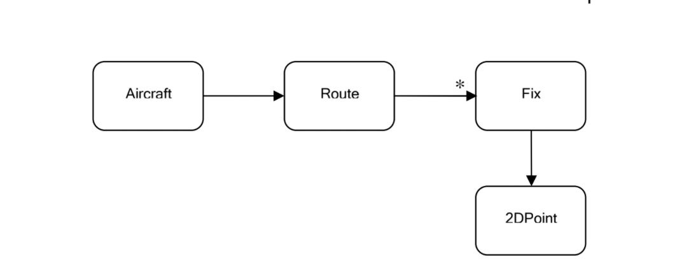

# Что такое Предметно-Ориентированное Проектирование

Разработка программного обеспечения чаще всего применяется для автоматизации процессов, существующий в реальном мире, или предоставления решений реальных задач бизнеса; **Бизнес процессы ...** Мы должны с самого начала понимать, что ПО происходит из определенной предметной области и глубоко с ней связано.

ПО состоит из кода. У нас может возникнуть соблазн потратить слишком много времени на код и рассматривать систему только как набор объектов и методов.

Рассмотрим создание автомобилей как метафору. Работники, вовлеченные в создание авто могут специализироваться на создании частей автомоболя, но делая это они так же часто имеют ограниченное видение всего процесса создания авто. Они начинают рассматривать машину как огромную коллекцию частей которые должны подходить друг к другу, но автомобиль это нечто гораздо большее. Хорошая машина начинается с видения. Она начинаетс с тщательно описанной спецификации. И продолжается в проектировнии. В большом-большом количестве проектирования. Месяцы, возможно годы тратятся на проект, изменяя и очищая его пока он не достигнет совершенства, пока он не станет отображать исходное видение. Не все проектирование происходит на бумаге. БольшАя его часть включает создание моделей автомобиля, и проверка их в определенных условиях, чтобы узнать работает ли задуманное. Проект изменяется на основании полученных результатов. В конце концов автомобиль уходит в производство, его части создаются и собирабтся воедино.

Разработка программного обеспечения во многом похожа. Мы не можем просто сесть и писать код. Это сработает только для тривиальных задач. Но мы не можем таким образом создать сложную систему.

Чтобы создать хорошее программное обеспечение, вы должны понимать что оно из себя представляет. Невозможно создать банковское ПО, пока у вас нет хорошего понимания что такое банковское дело, нужно разбираться в *предмете/домене (domain)*  банковского дела.

Возможно ли создать сложное банковское ПО не разбираясь в предмете? Нет. Никогда. Кто разбирается в банковском деле? Архитектор программного обеспечения? Неа. Он пользуется банком только чтобы хранить свои деньги и получать к ним доступ когда необходимо. Может аналитик? Не совсем. Он знает как проализировать заданную тему, когда ему дали все необходимые составляющие. Разработчик? Даже не думайте об этом. Кто же тогда? Работники банка, конечно. В банковской системе отлично разбираются люди внутри нее, специалисты. Они знают все детали, все уловки, все возможные проблемы, все правила. Это то, с чего мы всегда должны начинать: домен.

Когда мы начинаем разработку программного продукта, мы должны сосредоточиться на той области, в которой он работает. Вся цель программного обеспечения - улучшить конкретную предметную область. Чтобы добиться этого, ПО должно гармонично вписываться в предметную область, для которой создавалось. В противном случае оно привнесет напряжение в эту область, провоцируя сбои в работе, повреждения и даже сея хаос.

Как же мы можем добиться гармоничной работы ПО внутри домена? Лучший способ - это сделать программное обеспечение отражением предметной области. Программное обеспечение должно включать в себя основные концепции и элементы предметной области и точно реализовывать отношения между ними. ПО должно моделировать предметную область.

Кто-то без знаний банковского дела должен почерпнуть многое о нем, просто читая код модели этой области. Это очень важно. Программное обеспечение, которое не уходит глубоко корнями в предметную область не сможет корректно реагировать на изменения с течением времени.

Хорошо, начнем с домена. Как это? Предметная область это что-то из реального мира. Ее нельзя просто взять и перелить через клавиатуру в компьютер, чтобы она стала кодом. Мы должны создать абстракцию предметной области. Мы изучаем предмет, когда общаемся с его экспертами. Но это необработанное знание будет нелегко превратить в программные конструкции, пока мы не построим его абстракцию, схему в нашем сознании. В начале, схема всегда неплоная. Но со временем, в процессе работы, мы ее улучшаем и обретаем более четкое понимание. Что значит абстракция? Это модель, модель предметной области. Согласно Эрику Эвансу, модель предметной области это не особая диаграмма; это идея, которую призвана передать диаграмма. Это не просто знание домена в голове эксперта; это строго организованная и выборочная абстракция этого знания. Диаграмма может представлять и передавать модель, так же как может тщательно написанный код или предложение на англигийском языке.

Модель - это наше внутреннее представление целевой предметной области, и она крайне необходима на протяжении всего процесса проектирования и разработки. В процессе проектирования мы запоминаем модель и создаем множество ссылок на нее. Окружающий мир слишком сложен для нас, чтобы умещаться у нас в голове. Даже один домент может быть слишком велик, чтобы одноновременно охватить все его содержимое целиком. Нам необходимо организовывать информацию, чтобы систематизировать ее, разделять на более мелкие части, чтобы после сгруппировать их в логические модули и работать с одним за раз. Нам даже требуется оставлять некоторые части домена вне модели. Просто предметная область содержит слишком многое, чтобы включить это все в модель. И многое из этого даже нет необходимости учитывать. Это само по себе уже непросто. Что нужно оставить, а от чего стоит избавиться? Это часть проектирования, процесса создания программного обеспечения. Банковское ПО определенно будет следить за адресом клиента, но ему не нужно знать цвет его глаз. Этот пример очевиден, но прочие могут быть не настолько очевидны.

Модель это неотъемлемая часть разработки программного обеспечения. Она необходима нам для того чтобы бороться со сложностью. Весь наш мыслительный процесс о предметной области собран в этой модели. Это хорошо, но нам нужно уметь как-то выносить его за пределы нашей головы. Ведь это будет не слишком полезно, если он навсегда останется там, не так ли? Нам нужно доносить детали этой модели экспертам предметной области, коллегам архитекторам и разработчикам. Модель является основой программного обеспечения, но нам нужны способы, чтобы описать ее и донести до остальных. Так что нам необходимо уметь делиться знаниями и информацией, и делать это нужно точно, полно и недвусмысленно. Для этого существуют несколько разных способов. Первый - графический: диаграммы, юзкейсы, рисунки, изображения и т. д. Второй - письменный. Мы записываем свое видение домена. Следующий - язык. Мы можем и должны создать язык для обсуждения конкретных вопросв предметной области. Мы погрузимся в детали позже, пока же основная мысль в том, что *нам необходимо уметь общаться на уровне модели*. 

После того, как мы описали модель предметной области, можно приступить к работе над дизайном кода (code design). Дизайн кода не тоже самое, что дизайн/проектирование программного обеспечения (software design). Дизайн ПО похож на создание архитектуры здания, про общую картину. С другой стороны, дизайн кода это работа над деталями, например, выбор положения картины на стене. Дизайн кода так же крайне важен, но не так фундаментален, как дизайн ПО. Ошибку в дизайне кода обычно легче исправить, в то время как исправление ошибок дизайна ПО обойдется гораздо дороже. Одно дело подвинуть картину левее, и совсем другое - снести одну сторону дома, чтобы полностью ее переделать. Тем не менее это не значит, что конечный продукт будет качественным без хорошего дизайна кода. В этом месте на помощь приходят подходы к дизайну кода и они должны применяться, когда необходимо. Хорошие техники написания кода помогают создавать чистый, поддерживаемый код.

Существуют разные подходы к проектированию ПО. Один из них - водопадная модель. Этот метот включает несколько стадий. Эксперты бизнеса предоставляют бизнес-аналитикам набор требований. Аналитики создают модель на основе этих требований и передают результаты разработчикам, которые начинают писать код на основе того, что получили. Это однонаправленный поток передачи знаний. Хотя этот подход и был традиционным при дизайне ПО и использовался с определенным успехом на протяжении многих лет, он имеет свои недостатки и ограничения. Основная проблема в том, что в нем нет обратной связи для аналитиков и бизнеса или для разработчиков и аналитиков.

Еще один подход это гибгие методологии (agile), например, экстремальное программирование (XP). Эти методологии представляют собой коллективное движение против водопадной модели, возникшее в результате трудностей, связанных с попытками заранее сформулировать все требования, особенно в условиях изменения последних. Действительно сложно создать полную модель, которая покрывает все аспекты предметной области наперед. Это требует много времени на обдумывание и часто просто нельзя увидеть все проблемы с самого начал, так же как и нельзя предсказать нежелательные последствия или ошбики вашего дизайна. Другая проблема, которую пытается решить Agile называется "паралич анализа" ("analysis paralysis"), когда члены команды настолько боятся принимать любые архитектурные решения, что прогресс замедляется до нуля. Хотя сторонники Agile и признают важность архитектурных решений, они против предварительного проектирования. Вместо этого они используют преимущества гибкой разработки, и с через итеративную разработку с постоянным участием заинтересованных лиц бизнеса и большим количеством рефакторинга, команда разработки узнает больше о домене заказчика и может создать ПО лучше удовлетворяющее потребностям клиента.

Методы гибкой разработки имеют собственные сложности и ограничения; они отстаивают простоту, но все понимают это по-своему. Так же постоянные рефакторинг без строгих правил дизайна порождает код, сложный для понимания и изменений. И хотя водопадная модель может вести к оверинженирингу (over-engineering), страх оверинжениринга может вести к другому страху: страху делать глубокий, хорошо продуманный дизайн.

Эта книга представляет принципы предметно ориентированного проектирования, которое будучи примененным, может значительно повыстить способность любого процесса разработки моделировать и реализовывать сложные задачи домена удобным для поддержки образом. Предметно Ориентированное Проектирование, соединяет практики проектирования и разработки они могут работать вместе для создания лучших решений. Хороший дизайн ускоряет разработку, а обратная связь, полученная в процессе разработки, улучшает дизайн.

## Создание системы знаний о домене

Давайте представим проект системы контроля полета самолетов, и как в этом случае могла бы быть построена система знаний.

В конкретный момент времени в воздухе могут находиться тысячи самолетов по всему миру. Они летят по своим маршрутам к пунктам назначения, и мы должны быть уверенны, что они не столкнутся в воздухе. Мы не будем вдаваться в подробности всей системы управления движением, рассмотрим меньшую часть - систему мониторинга полетов. Предложенный проект представляет собой систему мониторинга, которая отслеживает каждый рейс в определенной области, определяет следует ли он намеченному маршруту и существует ли возможность столкновения.

С чего начать с точки зрения разработки программного обеспечения? В предыдущем разделе мы говорили, что следует начинать с понимания предметной области. В нашем случае это мониторинг воздушного траффика. Специалисты в этой области - авиадиспетчеры. Но они не яляются архитекторами систем или специалистами разработки ПО. Нельзя ожидать, что они предоставят все необходимое описание домена.

Авиадиспетчеры обладают огромным знанием об их домене, но для того, чтобы построить модель вам необходимо извлечь ключевую информацию и обобщить ее. Когда вы начнете разговор с ними, вы услышите многое о том как взлетают и приземляются воздушные судна, о самолетах в воздухе и опасности столкновения, о самолетах, ожидающих разрешения на посадку. Чтобы упорядочить весь это информационный хаос, нужно с чего-то начать.

Вы с диспетчером приходите к тому, что у каждого самолета есть аэродром вылета и прибытия. Так, у нас есть воздушное судно, вылет и назначение, как показано на схеме ниже.

Хорошо, самолет где-то взлетает и касается земли в другом. Но что происходит в воздухе? По какому именно пути следует самолет? Вообще говоря, нас больше интересует что происходит пока он в воздухе. Диспетчер говорит, что у каждого самолета есть определенный план полета, который должен описывать все путешествие целиком. Услышав о плане полета, вы можете подумать, что речь о пути, которой следует самолет пока находится в воздухе. После дальнейшей дискуссии, вы слышите интересное слово: маршрут. Оно моментально привлекает ваше внимание и неспроста. Маршрут содержит важную концепцию воздушного путешествия. Это то, что самолеты делают во время полета - они следуют маршруту. Очевидно, что точки вылета и прилета, это начальная и конечная точки маршрута. Так что, вместо того, чтобы привязывать воздушное судно к точкам вылета и прилета, кажется более естественным связать его с маршрутом, который в свою очередь связан с соответствущим вылетом и прилетом.

Обсуждая с диспетчером маршруты, которым следуют самолеты, вы выясняете, что вообще-то маршрут состоит из маленьких сегментов, которые собранные вместе, составляют своего рода кривую соединяющую вылет и прилет. Линия должна проходить через определенные фиксированные точки. Так что можно описать маршрут, как серию последовательных местоположений. Возмо это не то, что видит диспетчер, но это необходимая абстракция, которая поможет в будущем. В результате изменений, оснванных на последних открытиях получим следующую схему:

Новая диаграмма показывает еще один момент, а именно факт того, что маршрут состоит из множества местоположений, которые в свою очередь являются трехмерными точками в пространстве. Однак, когда вы общаетесь с диспетчером, выясняется, что он видит это не таким образом. На самом деле, для него маршрут - это проекция на пути самолета на поверхность земли. Местоположения - это просто точки на поверхности Земли, уникально определяемые их широтой и долготой. Так что на самом деле верная диаграмма будет такой:

Что тут происходит на самом деле? Вы вместе с экспертами предметной области общаетесь и обмениваетесь знанием. Вы начинаете задавать вопросы, а они отвечать. Пока они делают это, они добираются до основопологающих концепций из области воздушного траффка. Это концепции могут быть неаккуратными и неорганизованными, но тем не менее они необходимы для понимания предметной области. Вам необходимо узнать как можно больше от экспертов. Задавая верные вопросы и корректно обрабатывая информацию, вместе с экспертами, вы начинаете создавать набросок представления предметной области, доменной модели. Это представление не является ни полным, ни корректным, но это то, с чего нужно начать. Постарайтесь выяснить ключевые концепции предметной области.

Это важная часть проектирования. Обычно происходят долгие обсуждения между архитекторами или разработчиками и экспертами домена. Специалисты разрабоки ПО хотят извлечь знания из экспертов домена, кроме того они должны выразить его в удобной форме. В какой-то момент они могут захотеть создать ранний прототип, чтобы посмотреть как он работает на данный момент. Пока они этим занимаются, могут обнаружиться проблемы, связанные с созданной моделью или подходом. Возможно они захотят изменить модель. Взаимодействие не обязательно должно быть однонаправленным - от экспертов домена, к архитекторам и после к разработчикам. Должна быть и обратная связь, которая помогает создать лучшую модель и более ясное понимание предметной области. Эксперты хорошо знают свою область, но они организуют и используют свои знания особым образом, который не всегда является наилучшим для реализации в программной системе. Аналитические способности разработчика программного обеспечения помогают раскрыть некоторые из ключевых концепций предмметной области во время обсуждения с экспертами области, и так же помогают составит некоторую структуру на которой будут основаны дальнейшие обсуждения, как мы увидим в следующей главе. Мы, специалисты ПО (архитекторы и разработчики) и специалисты предметной облатси создаем доменную модель совместно, и это то место, где встречаются эти две области знаний. Может показаться, что такое занятие занимает много времени, и это так, но именно так оно и должно быть. Потому что в конечном итоге, задача программного обеспечения это решать задачи реальной предметной оьбласти, так что оно должно идеально с ней сочетаться.
