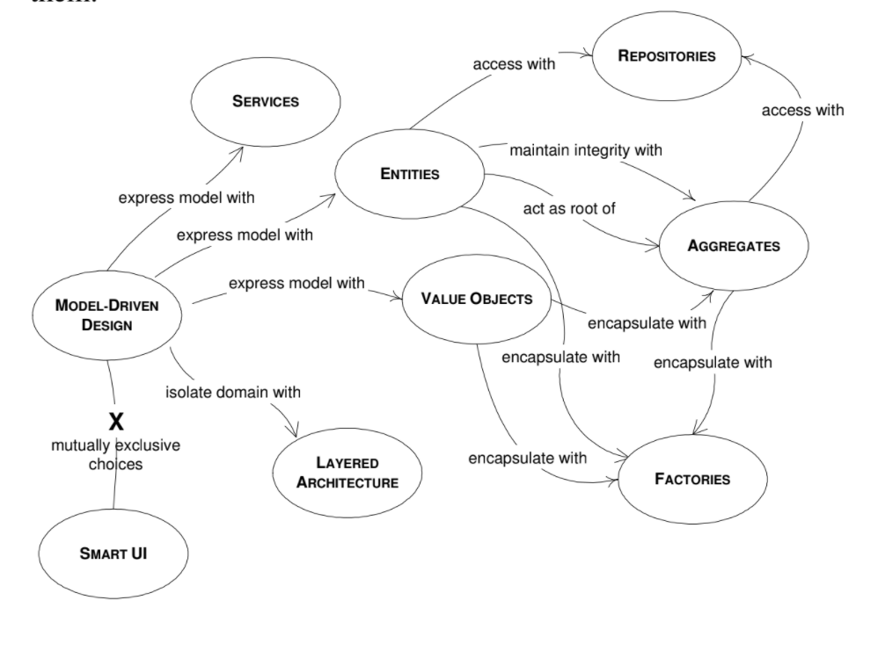
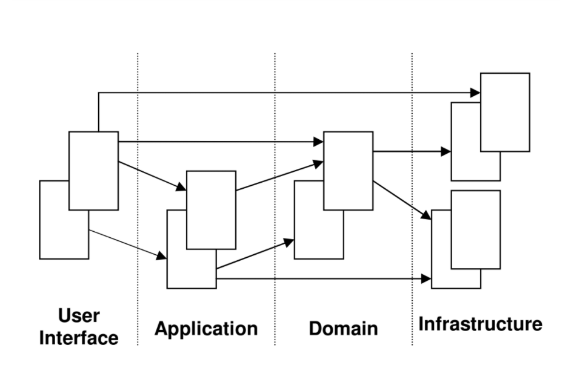

# Модельно-Оринтированная Архитектура

В предыдущих главах подчеркивалась важность подхода к разработке ПО, которая сосредоточена вокруг предметной области бизнеса. Мы говорили, что критически важно создать модель, которая основывается на предметной области и отражает ее ключевые концепции с высокой точность. Универсальный язык следует использовать на протяжении всего процесса моделирования, для того, чтобы способствовать общению между командой разработки и экспертами домена, а так же чтобы выявить ключевые концепции домена, которые должны быть использованы в модели. Цель процесса моделирования - создать качественную модель. Следующий шаг - имплементация модели в коде. Это столь же важная фаза процесса разработки ПО. Создав отличную модель, но неудачно перенеся ее в код, вы получите программное обеспечение сомнительного качества.

Может так случиться, что аналитики работают с экспертами предметной области месяцами, выясняют ключевые части домена, выражают связи между ними и создают качественную модель, которая точно отражает суть предметной области. Потом модель передается к разработчикам. Они в свою очередь могут выяснить, что некоторые концепции или связи модели не могут быть должным образом выражены в коде. Поэтому они будут использовать модель, как основу для идей, но создадут свой собственный дизайн, который частично позаимствует идеи из модели, а частично будет состоять из заново созданных. Процесс разработки продолжится, будут создаваться новые классы, увеличивая разрыв между оригинальной моделью и итоговой реализацией. Гарантий хорошего конечного результат нет. Хорошие разработчики смогут создать продукт, который работает, но сможет ли он выдержать испытание временем? Будет ли он хорошо расширяемым? А легко поддерживаемым?

Любая предметная облать может быть описана множеством моделей, а каждая модель может быть по-разному выражена в коде. Для каждой конкретной задачи может быть более одного решения. Какое именно стоит выбрать? Не каждая корректная аналитическая модель можеть быть прямо выражена в коде. Или, возможно, ее реалзация нарушит какие-то принципы проектирования приложения, что, конечно же, не очень хорошо. Поэтому важно выбирать модель, которая легко и точно может быть перенесена в код. Значит основной вопрос здесь - как мы переходим от модели к коду?

Одним из рекомендуемых методов проектирования является так называемая модель анализа, которая рассматривается отдельно от разработки кода и обычно выполняется разными людьми. Модель анализа является результатом анализа бизнес-области, в результате чего модель не учитывает программное обеспечение, используемое для реализации. Такая модель используется для понимания предметной области. Построен определенный уровень знаний, и полученная модель может быть аналитически правильной. Программное обеспечение на данном этапе не принимается во внимание, поскольку считается фактором, сбивающим с толку. Эта модель доходит до разработчиков, которые должны заниматься дизайном. Поскольку модель была построена без учета принципов дизайна, она, вероятно, не будет служить этой цели. Разработчикам придется его адаптировать или создать отдельный дизайн. И между моделью и кодом больше нет соответствия. В результате после начала кодирования от моделей анализа вскоре отказываются.

Одна из основных проблем этого подхода в том, что аналитики не могут предвидеть некоторые дефекты в их модели, а так же все тонкости домена. Они могут слишом сильно уйти в детали для одних компонетнтов и наоборот недостаточно осветить другие. Очень важные детали выясняются во время проектирования и реализации. Модель, соответствующая домену, может иметь серьезные проблемы с хранением объектов или неприемлемой производительностью. Разработчики будут вынуждены принимать некоторые решения самостоятельно и делать изменения в архитектуре, чтобы решить реальные проблемы, которые не учитывались, когда создавалась модель. Они создают архитектуру, которая отдаляется от модели, делая ее менее релевантной.

При независимой работе аналитиков, в конечном итоге они создадут модель. Когда она будет передана архитекторам, некоторая часть знаний аналитиков о домене будет потеряна. Хотя модель моожет быть выражена в диаграммах и документах, есть шансы, что архитекторы не поймут весь смысл модели, или отношений между некоторыми объектами, или их поведения. Есть детали модели, которые сложно передать через диаграмму и даже письменно. Разработчики столкнутся со сложностями пытаясь их выяснить. В некоторых случаях они будут делать некоторые предположения о предполагаемом поведении, и возможно такое, что часть из них будет неверна, что станет причиной некорректно работающей программы.

Аналитики встречаются на своих, закрытых, митингах, где обсуждаются многие детали, касающиеся домена и происходит интенсивный обмен знаниями. Они создают модель, которая должна включать в себя всю эту информацию в сжатом виде, а разработчики должны усвоить всю эту информацию, читая предоставленную документацию. Будет гораздо более продуктивно, если разработчики смогут присоединится к встречам аналитиков, и таким образом получить ясное и полное представление о предметной области и модели до того, как начнут работать над архитектурой.

Лучшим подходом является тесно связать моделирование предметной области и разработку архитектуры. Модель должна создаваться с учетом особенностей архитектуры программного обеспечения. Разработчики должны быть включены в процесс моделирования. Основная идеят состоит в выборе модели, которая сможет быть соответствующим образом выражена в коде, так чтобы процесс проектирования (архитектуры) был прозрачным и основывался на модели. Тесная связь кода и модели, на которой он основан придает ему ясность и делает модель релевантной.

Вовлечение разработчиков порождает обратную связь. Это создает уверенность в том, что модель может быть реализована в ПО. Если где-то есть ошибка, то это обнаруживается на более ранней стадии и проблему можно просто решить.

Те, кто пишет код, должны знать модель очень хорошо и чувствовать ответственность за ее целостность. Они должны понимать,  что изменение в коде подразумевает изменение в модели; иначе они модифицируют код до того состояния, когда он больше не будет описывать исходную модель. Если аналитик отделен от процесса реализации, вскоре, он перестанет беспокоиться об ограничениях, привносимых разработкой. Как результат - модель, не имеющая практического применения.

Любой технический специалист, вносящий изменения в модель должен потратить некоторое время на изучение кода, не важно насколько высокую роль он или она играет в проекте. Каждый, ответственный за измненение кода должен научиться выражать модель посредством кода. Каждый разработчик должен участвовать в обсуждении модели на определенном уровне и иметь связь с экспертами предметной области. Те, кто вносит свой вклад другими способами должны сознательно вовлекать тех, кто связан с кодом в динамический процесс обмена идей о модели посредством Универсального Языка.

Если архитектура или какая-то ее важная часть не соответствует модели предметной области, эта модель имеет небольшую ценность и корректнотсь созданного ПО находится под вопросом. В то же время, если связи между моделью и архитектурой есть, но они сложны для понимания, то на практике они окажутся не поддерживаемы. Так, между архитектурой и анализом возникает непреодолимая пропасть, и идеи полученные в любой из эти частей не развивают другую.

Спроектируйте часть системы, чтобы она максимально только отражала модель, так чтобы это отображение было очевидным. Пересмотрите модель и измените так, чтобы она могла быть реализована более естественным образом в коде, даже если вы стремитесь, чтобы она отражала понимание домена более глубоко. Требуйте единую модель, которая соответствует обеим целям, в дополнение к повсеместной поддержке Универсального Языка.

Извлеките из модели терминологию, используемую в архитектуре (и базовое распределение обязанностей). Код должен стать выражением модели, так что изменение кода может быть и изменением модели. Этот эффект должен распространиться и на всю остальную деятельность проекта.

Чтобы тесно связать реализацию и модель, обычно нужны такие инструменты для создания ПО и языки, которые поддерживают парадигму моделирования, например ООП.

ООП подходит для реализации модели, потому что они оба основаны на одной парадигме. ООП предоставляет классы объектов и связи классов, экземпляры объекто и общение между ними. ООП языки делают возможным прямые отображения между объектами модели с их связями, и их аналогами в коде.

Процедурные языки предлагают ограниченную поддержку модельно-ориентированной архитектуры. Таки языки не предлагают конструкций необходимых для имплементации ключевых компонентов модели. Некоторые скажут, что ООП может быть реализовано с помощью процедурного языка Си, действительно, некоторые функции могут быть воспроизведены таким образом. Объекты могут быть представлены как структуры данных (data structures). Таки структуры не содержат поведения объекта, и оно должно быть добавлено отдельно ввиде функций. Эти связи будут существовать только в голове разработчика, потому что код сам по себе не будет явно их выражать. Программа, написанная на процедурном языке обычно представляется как набор функций, вызывающийх одна другую и работающих вместе для достижения определенного результата. Такая программа не может легко инкапсулировать концептуальные связи, что усложнаяет понимание того, как модель связана с кодом.

Некоторые специфичные домены, вроде математики, могут быть легко смоделированы и реализованы используя процедурное программирование, потому что многие математические теории рассматриваются как вызов функций и структуры данных, потому что в основном речь идет о вычислениях. Более сложносоставные области - это не просто набор абстракций, содержащих вычисления и не могут быть сведены к набору алгоритмов, так что процедурные языки не справляются с задачей выражения соответствующий моделей. По этой причине, процедурное программирование не рекомендуется для модельно-ориентированной архитектуры.

## Составляющие Модельно-Ориентированной Архитектуры

Последующие части этой главы расскажут о наиболее важных паттернах модельно-ориентированной архитектуры. Задача этих паттернов представить ключевые элементы объктного моделирования и архитектуры ПО с точки зрения DDD. Диаграмма ниже - это карта паттернов и отношений между ними.

### Слоеная Архитектура

Когда мы создаем программное приложение, большАя его часть не связана напрямую с доменом, но является частью инфраструктуры или обслуживает само программное обеспечение. Вполне нормально для доменной части приложения быть довольно маленькой по сравнению с остальным, ведь типичное приложение включает в себя много кода, связанного с доступом к базам данных, файлам, сетям, а так же пользовательские интерфейсы и так далее.

В объектно-ориентированной программе, UI, база данных и прочий вспомогательный код обычно пишется напрямую в бизнес-объектах. Дополнительная бизнес-логика встроена в поведение виджетов интерфейса и скрипты базы данных. Иногда это происходит потому что это самый быстрый способ заставить все работать (быстро).

Однако, когда код, связанный с предметной областью смешивается с другими слоями, его становится чрезвычайно сложно читать и осмысливать. Поверхностные изменения интерфейса могут изменить бизнес-логику. Для изменения бизнес-правила, может потребоваться тщательное отслеживание его среди кода UI, базы данных и других элементов приложения. Реализация согласованных, основанных на модели объектов становится непрактичной. Автоматическое тестирование неудобным. Учитывая все разнообразие технологий и логики, задействованных в каждом действии, программа должна оставаться очень простой, иначе ее будет невозможно понять.

Следовательно, нужно разделить сложную программу на СЛОИ. Разрабатывать архитектуру внутри каждого СЛОЯ, который является связным и зависит только от слоев ниже. Следуйте стандартным архитектурным шаблонам, чтобы обеспечить слабую связность со слоями выше. Сконцентрируйте весь код, относящийся к домену в одном слое и изолируйте его от интерфейса пользователя, кода приложения и инфраструктурного кода. Объекты домена, освобожденные от задач отображения самих себя, хранения, управления задачами приложения и так далее, могут быть сосредоточены на выражении доменной модели. Это позволяет модели развиваться и становиться достаточно богатой и чистой, чтобы улавливать ключевые знания о бизнесе и применять их на практике.

Общее арихтектурное решение для предметно-ориентированных архитектур включает четыре концептуальных слоя:

| Header                          | Title       |
| Paragraph                       | Text        |
